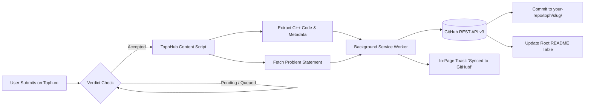

<div align="center">

# ⚡ TophHub

### Automatically Sync Your Accepted Toph.co C++ Solutions to GitHub
*A lightweight, zero-configuration browser extension for the competitive programming community.*

[](https://developer.chrome.com/docs/extensions/mv3/intro/)
[](https://isocpp.org/)
[](./LICENSE)
[](https://github.com/)

[**Features**](#-features) • [**Installation**](#-installation-for-users) • [**How It Works**](#-how-it-works) • [**CLI Companion**](#-companion-cli-for-local-coding) • [**Contributing**](#-contributing)

---

</div>

## 💡 Why TophHub?

When practicing on platforms like LeetCode or Codeforces, tools like *LeetHub* allow developers to effortlessly maintain an updated portfolio on GitHub. However, the vibrant competitive programming community on **[Toph.co](https://toph.co)** had to manually copy, paste, and commit their solutions.

**TophHub** solves this! Just solve problems on Toph.co as you normally do — the moment your submission receives an **Accepted (AC)** verdict, TophHub captures your C++ code, problem statement, CPU runtime, and memory stats, and automatically commits them to your GitHub repository in real time.

---

## 🌟 Features

- 🚀 **100% Automated Synchronization**: Syncs immediately upon receiving an "Accepted" verdict on Toph.co.
- ⚡ **Tailored for C++**: Supports C++17, C++20, and GNU C++ with clean metadata headers (Problem title, URL, Time, Memory, Submission ID).
- 📝 **Automatic Problem Documentation**:
  - Creates a dedicated folder for each problem: `toph/<problem-slug>/`
  - Saves your code in `solution.cpp`.
  - Generates a rich `README.md` containing the problem description, constraints, and sample test cases.
- 📊 **Dynamic Root Solved Table**: Automatically maintains an indexed, clickable markdown table of all solved problems in your repository's root `README.md`.
- 🎨 **Modern Dark-Mode UI**: Sleek glassmorphism popup with stats tracker (problems solved counter, connection status, direct repo link).
- 🔔 **In-Page Feedback**: Elegant bottom-right toast notification on Toph.co with direct clickable link to your GitHub commit.
- 🛠️ **Companion Local CLI**: Includes an offline Fast I/O C++ template & terminal tool (`node cli/toph.js`) for local coding.

---

## 📥 Installation (For Users)

Installing TophHub takes **less than 60 seconds** and requires no coding knowledge. It works on **Google Chrome**, **Microsoft Edge**, **Brave**, **Opera**, and any Chromium browser.

### Option 1: Download the Pre-Packaged ZIP (Easiest)
1. Download [**`tophhub-extension.zip`**](./tophhub-extension.zip) from this repository (or from the Releases section).
2. Unzip / Extract the downloaded folder on your computer.
3. Open your browser and go to:
   - **Chrome / Brave:** `chrome://extensions`
   - **Edge:** `edge://extensions`
4. Turn on the **Developer mode** switch (in the top-right corner).
5. Click the **Load unpacked** button (in the top-left corner).
6. Select the extracted **`extension`** folder.
7. 🎉 TophHub is now installed! Pin it to your browser toolbar for easy access.

### Option 2: Clone with Git
```bash
git clone https://github.com/yasir-newb/tophhub.git
cd tophhub
```
Then load the `extension/` directory via `chrome://extensions` -> **Load unpacked**.

---

## ⚙️ Configuration (One-Time Setup)

1. **Get a GitHub Personal Access Token**:
   - Go to [GitHub Token Settings](https://github.com/settings/tokens/new?scopes=repo&description=TophHub-Sync).
   - Set a description (e.g., `TophHub-Sync`).
   - Check the **`repo`** permission (required so TophHub can commit files to your repo).
   - Click **Generate token** and copy your token (`ghp_...`).

2. **Connect TophHub**:
   - Click the **TophHub** extension icon in your browser toolbar.
   - Paste your **GitHub Token**.
   - Enter your target repository name (e.g. `your-username/Toph-Solutions`).
     > 💡 **Tip:** If the repository doesn't exist yet on GitHub, simply click **"Create Repo For Me"** and TophHub will create it automatically for you!
   - Click **Save & Connect**. The indicator turns green (`Connected`).

---

## 🎯 How to Use

1. Go to any problem on [Toph.co](https://toph.co/problems) (for example: [Formatted Numbers](https://toph.co/p/formatted-numbers)).
2. Write your solution in **C++** and click **Submit**.
3. Once the judge gives you an **Accepted** verdict:
   - TophHub pops up an in-page toast:  
     `🎉 Synced with GitHub! Formatted Numbers committed to your repo [View on GitHub ↗]`
   - Your GitHub repository is instantly updated!

---

## 📂 Repository Structure Created by TophHub

When you solve problems, your GitHub repository will look clean and professional:

```
Toph-Solutions/
├── README.md                      # Index table of all solved problems & stats
└── toph/
    ├── formatted-numbers/
    │   ├── README.md              # Problem statement, constraints & samples
    │   └── solution.cpp           # Your accepted C++ solution
    ├── copycat/
    │   ├── README.md
    │   └── solution.cpp
    └── thought-game/
        ├── README.md
        └── solution.cpp
```

### Sample Generated `solution.cpp`
```cpp
/**
 * Problem: Formatted Numbers
 * Problem URL: https://toph.co/p/formatted-numbers
 * Language: C++20
 * Verdict: Accepted
 * CPU Time: 0.02s | Memory: 1.2 MB
 * Submission ID: 894120
 * Synced: 2026-09-09
 *
 * Synced by TophHub - Competitive Programming to GitHub
 */

#include <iostream>
#include <string>
#include <algorithm>

using namespace std;

int main() {
    string s;
    cin >> s;
    int n = s.size();
    string res = "";
    int cnt = 0;
    for (int i = n - 1; i >= 0; i--) {
        res += s[i];
        cnt++;
        if (cnt % 3 == 0 && i > 0) res += ',';
    }
    reverse(res.begin(), res.end());
    cout << res << "\n";
    return 0;
}
```

---

## ⚡ Built-in C++ Competitive Programming IDE

TophHub now includes a complete, dedicated **C++ Competitive Programming Studio** directly inside the repository!

### 🎯 IDE Features:
- **3-Panel Layout**:
  - 📖 **Problem Statement Viewer**: Load problems and sample cases by slug or URL.
  - 💻 **C++ Code Editor**: Syntax highlighting, line numbers, smart indentation, bracket auto-closing, and Fast I/O templates.
  - 🧪 **Test Case Workbench**: Multiple test cases, custom stdin, expected output diff checker, runtime and memory metrics.
- **Zero-Setup Compilation (GCC / C++20)**: Compiles and runs C++ code instantly via cloud execution API without needing MinGW or local compiler setup!
- **1-Click GitHub Push**: Automatically commits your solution to `toph/<slug>/solution.cpp` on GitHub.
- **Copy for Toph**: One-click copy formatted solution ready to submit on Toph.co.

### 🚀 How to Launch the IDE:

**Method 1: From the Browser Extension (Easiest)**
Click the **TophHub** icon in your browser toolbar and click **"Open IDE ↗"**. It opens in a new full-screen tab!

**Method 2: Run with npm**
```bash
npm run ide
```
Then open `http://localhost:3000` in your browser.

**Method 3: Direct File Launch**
Double-click `ide/index.html` to open it in your browser offline!

---

## 💻 Companion CLI (For Local Offline Coding)

Prefer writing and testing your C++ code locally in your IDE? A companion CLI tool is included:

```bash
# 1. Initialize local workspace and Git tracking
node cli/toph.js init

# 2. Create a new problem template pre-filled with Fast I/O
node cli/toph.js new formatted-numbers

# 3. Test and solve locally in toph/formatted-numbers/solution.cpp

# 4. Push directly to your GitHub repository
node cli/toph.js push formatted-numbers
```

---

## 🔍 How It Works Under the Hood



1. **Observer**: The content script monitors the submission URL (`toph.co/s/*`) using dynamic DOM inspection and `MutationObserver`.
2. **Extractor**: Captures pristine C++ code, runtime statistics, memory consumption, and problem statement.
3. **Committer**: The service worker encodes the payload and interfaces directly with the official GitHub REST API (`PUT /repos/{owner}/{repo}/contents/{path}`).
4. **Deduplication**: Remembers already-synced submission IDs in `chrome.storage.local` to prevent duplicate commits.

---

## 🤝 Contributing

Contributions, issues, and feature requests are welcome!
Feel free to check out the [issues page](https://github.com/) if you want to contribute.

1. Fork the Project
2. Create your Feature Branch (`git checkout -b feature/AmazingFeature`)
3. Commit your Changes (`git commit -m 'Add some AmazingFeature'`)
4. Push to the Branch (`git push origin feature/AmazingFeature`)
5. Open a Pull Request

---

## 📄 License

Distributed under the **MIT License**. See [`LICENSE`](./LICENSE) for more information.

---

<div align="center">

Made with ❤️ for the **Toph.co** and **Competitive Programming** Community.  
⭐ If you find this project helpful, please give it a star on GitHub!

</div>
