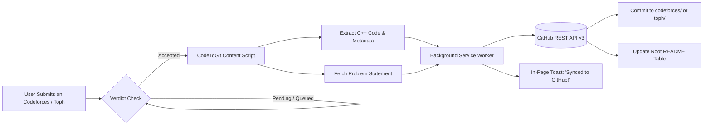

<div align="center">

# ⚡ CodeToGit (CTG)

### Automatically Sync Your Accepted C++ Solutions to GitHub
*A lightweight, zero-configuration browser extension & studio for the competitive programming community.*

[](https://developer.chrome.com/docs/extensions/mv3/intro/)
[](https://isocpp.org/)
[](./LICENSE)
[](https://github.com/)

[**Features**](#-features) • [**Installation**](#-installation-for-users) • [**How It Works**](#-how-it-works) • [**Code::Blocks & CLI**](#-codeblocks--companion-cli-integration) • [**Contributing**](#-contributing)

---

</div>

## 💡 Why CodeToGit (CTG)?

When practicing competitive programming on platforms like **[Codeforces](https://codeforces.com)** or **[Toph.co](https://toph.co)**, keeping your GitHub portfolio up to date usually requires tedious manual copying, pasting, and committing.

**CodeToGit (CTG)** automates this completely! Solve problems on **Codeforces** and **Toph.co** as you normally do — the moment your submission receives an **Accepted (AC)** verdict, CodeToGit captures your C++ code, problem statement, CPU runtime, and memory stats, and automatically commits them to your GitHub repository in real time.

---

## 🌟 Features

- 🚀 **100% Automated Synchronization**: Syncs immediately upon receiving an "Accepted" verdict on **Codeforces** and **Toph.co**.
- ⚡ **Tailored for C++ & Code::Blocks**: Supports C++17, C++20, and GNU C++ with clean metadata headers.
- 📝 **Automatic Problem Documentation**:
  - **Codeforces**: Dedicated folders `codeforces/<contestId>/<problemIndex>/` with solution and statement.
  - **Toph.co**: Dedicated folders `toph/<problem-slug>/` with solution and statement.
  - Generates a rich `README.md` containing the problem description, constraints, and sample test cases.
- 📊 **Dynamic Root Solved Table**: Automatically maintains an indexed, clickable markdown table of all solved problems across all platforms in your repository's root `README.md`.
- 🎨 **Modern Dark-Mode UI**: Sleek glassmorphism popup with stats tracker (problems solved counter, connection status, direct repo link).
- 🔔 **In-Page Feedback**: Elegant bottom-right toast notification on both Codeforces & Toph.co with direct clickable link to your GitHub commit.
- 🛠️ **Full Code::Blocks Support**: Generates `.cbp` project files, master workspace, and local file I/O redirection (`#ifndef ONLINE_JUDGE`).
- 💻 **Companion Local CLI (`ctg`)**: Includes an offline terminal tool (`node cli/toph.js` or `npm run ctg`) for local coding.

---

## 📥 Installation (For Users)

Installing CodeToGit (CTG) takes **less than 60 seconds** and requires no coding knowledge. It works on **Google Chrome**, **Microsoft Edge**, **Brave**, **Opera**, and any Chromium browser.

### Option 1: Download the Pre-Packaged ZIP (Recommended for Users)
1. Download [**`codetogit-extension.zip`**](./codetogit-extension.zip) from this repository.
2. **Extract / Unzip** the file on your computer:
   - *Windows:* Right-click `codetogit-extension.zip` → click **Extract All...** → click **Extract**.
   - *Mac / Linux:* Double-click to unzip.
3. Open your browser and navigate to:
   - **Chrome / Brave:** `chrome://extensions`
   - **Edge:** `edge://extensions`
   - **Opera:** `opera://extensions`
4. Turn **ON** the **Developer mode** toggle switch (in the top-right corner).
5. Click the **Load unpacked** button (in the top-left corner).
6. Select the unzipped folder (the folder that contains `manifest.json`).
7. 🎉 CodeToGit is now installed! Click the puzzle icon 🧩 and pin CodeToGit to your browser toolbar.

> ⚠️ **Common Mistake to Avoid:**  
> Do **NOT** drag and drop the `.zip` file into the browser! Chrome will reject it with `'CRX_HEADER_INVALID'`. You must **extract / unzip** the file first and use **Load unpacked**.

### Option 2: Clone with Git
```bash
git clone https://github.com/yasir-newb/CodeToGit.git
cd CodeToGit
```
Then in `chrome://extensions`, enable **Developer mode** → click **Load unpacked** → select either the cloned repository folder or its `extension/` subfolder.

---

## ⚙️ Configuration (One-Time Setup)

1. **Get a GitHub Personal Access Token**:
   - Go to [GitHub Token Settings](https://github.com/settings/tokens/new?scopes=repo&description=CodeToGit-Sync).
   - Set a description (e.g., `CodeToGit-Sync`).
   - Check the **`repo`** permission (required so CodeToGit can commit files to your repo).
   - Click **Generate token** and copy your token (`ghp_...`).

2. **Connect CodeToGit**:
   - Click the **CodeToGit** extension icon in your browser toolbar.
   - Paste your **GitHub Token**.
   - Enter your target repository name (e.g. `your-username/CodeToGit`).
     > 💡 **Tip:** If the repository doesn't exist yet on GitHub, simply click **"Create Repo For Me"** and CodeToGit will create it automatically for you!
   - Click **Save & Connect**. The indicator turns green (`Connected`).

---

## 🎯 How to Use

1. Go to any problem on **[Codeforces](https://codeforces.com/problemset)** or **[Toph.co](https://toph.co/problems)**.
2. Write your solution in **C++** (in Code::Blocks, the built-in IDE, or directly in the browser) and submit.
3. Once the judge gives you an **Accepted** verdict:
   - CodeToGit pops up an in-page toast:  
     `🎉 Synced with GitHub! Problem committed to your repo [View on GitHub ↗]`
   - Your GitHub repository is instantly updated in real-time!

---

## 📂 Repository Structure Created by CodeToGit

When you solve problems, your GitHub repository will look clean and professional:

```
CodeToGit/
├── README.md                      # Index table of all solved problems & stats across platforms
├── codeforces/
│   └── 1900/
│       └── A/
│           ├── README.md          # Problem statement, constraints & samples
│           └── solution.cpp       # Your accepted C++ solution
└── toph/
    ├── formatted-numbers/
    │   ├── README.md              # Problem statement, constraints & samples
    │   └── solution.cpp           # Your accepted C++ solution
    ├── copycat/
    │   ├── README.md
    │   └── solution.cpp
    └── thought-game/
        ├── README.md
        └── solution.cpp
```

### Sample Generated `solution.cpp`
```cpp
/**
 * Problem: Formatted Numbers
 * Problem URL: https://toph.co/p/formatted-numbers
 * Language: C++20
 * Verdict: Accepted
 * CPU Time: 0.02s | Memory: 1.2 MB
 * Submission ID: 894120
 *
 * Synced by CodeToGit (CTG) - Competitive Programming to GitHub
 */

#include <iostream>
#include <string>
#include <algorithm>

using namespace std;

int main() {
    string s;
    cin >> s;
    int n = s.size();
    string res = "";
    int cnt = 0;
    for (int i = n - 1; i >= 0; i--) {
        res += s[i];
        cnt++;
        if (cnt % 3 == 0 && i > 0) res += ',';
    }
    reverse(res.begin(), res.end());
    cout << res << "\n";
    return 0;
}
```

---

## ⚡ Built-in C++ Competitive Programming Studio

CodeToGit includes a complete, dedicated **C++ Competitive Programming Studio** directly inside the repository!

### 🎯 IDE Features:
- **3-Panel Layout**:
  - 📖 **Problem Statement Viewer**: Load problems and sample cases by slug or URL.
  - 💻 **C++ Code Editor**: Syntax highlighting, line numbers, smart indentation, bracket auto-closing, and Fast I/O templates.
  - 🧪 **Test Case Workbench**: Multiple test cases, custom stdin, expected output diff checker, runtime and memory metrics.
- **Zero-Setup Compilation (GCC / C++20)**: Compiles and runs C++ code instantly via cloud execution API without needing MinGW or local compiler setup!
- **📋 Automatic CP Header & Embedded Test Cases**: When loading any problem, the IDE automatically formats and generates clean C++ code.
- **🧪 Auto-Populated Test Workbench**: Automatically extracts all sample test cases and creates ready-to-run tabs (`Case 1`, `Case 2`, `Case 3`) with input and expected output!
- **🚀 1-Click Auto-Submit to Toph.co**: Click "Submit to Toph", and CodeToGit automatically opens the problem, selects C++, injects your solution, and submits it to the judge!
- **🔄 Seamless Automated Loop**: Code in IDE -> Click Submit -> Toph judge evaluates -> On **Accepted**, automatically pushed to GitHub!
- **1-Click GitHub Push**: Directly commit your solution to `toph/<slug>/solution.cpp` on GitHub anytime.
- **Copy for Toph**: One-click copy formatted solution to clipboard.

### 🚀 How to Launch the IDE:

**Method 1: From the Browser Extension (Easiest)**
Click the **CodeToGit** icon in your browser toolbar and click **"Open IDE ↗"**. It opens in a new full-screen tab!

**Method 2: Run with npm**
```bash
npm run ide
```
Then open `http://localhost:3000` in your browser.

**Method 3: Direct File Launch**
Double-click `ide/index.html` to open it in your browser offline!

---

## 🛠️ Code::Blocks & Companion CLI Integration

Love using **[Code::Blocks IDE](https://www.codeblocks.org/)** for competitive programming? CodeToGit comes with full, first-class Code::Blocks support:

### 🎯 Features for Code::Blocks:
- 📁 **Automated Project Generation (`.cbp`)**: Creates ready-to-run Code::Blocks projects pre-configured with GCC, C++20 / C++17, Debug and Release targets.
- 🚀 **1-Click Launch**: Run `node cli/toph.js cb <slug>` to open the problem directly in Code::Blocks!
- 🧪 **Automatic File I/O (`#ifndef ONLINE_JUDGE`)**:
  - Automatically generates `input.txt` pre-filled with official sample input from Toph.co.
  - Automatically redirects stdin to `input.txt` and stdout to `output.txt` during local testing in Code::Blocks, but runs standard I/O on Toph judge.
- 🌐 **Export from Web IDE**: Click **"Code::Blocks ▾"** in the built-in IDE to open directly in Code::Blocks or export `.cbp` starter pack.
- 📤 **File Upload Sync on Toph.co**: Submit your saved `.cpp` files from Code::Blocks on Toph.co — CodeToGit automatically captures the uploaded code and pushes it to GitHub upon receiving an Accepted verdict!

### 💻 Quick Code::Blocks CLI Commands:

```bash
# 1. Initialize workspace, Git tracking, and Code::Blocks workspace
node cli/toph.js init

# 2. Fetch problem, create solution.cpp, <slug>.cbp, and input.txt with sample cases
node cli/toph.js new formatted-numbers

# 3. Open directly in Code::Blocks IDE
node cli/toph.js cb formatted-numbers
# Or open the master Code::Blocks workspace:
node cli/toph.js cb

# 4. Code & press F9 (Build and Run) in Code::Blocks!
# Local testing automatically reads input.txt and writes to output.txt.

# 5. Push accepted solution to GitHub
node cli/toph.js push formatted-numbers
```

---

## 🔍 How It Works Under the Hood



1. **Observer**: The content script monitors the submission URL (`toph.co/s/*`) using dynamic DOM inspection and `MutationObserver`.
2. **Extractor**: Captures pristine C++ code, runtime statistics, memory consumption, and problem statement.
3. **Committer**: The service worker encodes the payload and interfaces directly with the official GitHub REST API (`PUT /repos/{owner}/{repo}/contents/{path}`).
4. **Deduplication**: Remembers already-synced submission IDs in `chrome.storage.local` to prevent duplicate commits.

---

## 🤝 Contributing

Contributions, issues, and feature requests are welcome!
Feel free to check out the [issues page](https://github.com/) if you want to contribute.

1. Fork the Project
2. Create your Feature Branch (`git checkout -b feature/AmazingFeature`)
3. Commit your Changes (`git commit -m 'Add some AmazingFeature'`)
4. Push to the Branch (`git push origin feature/AmazingFeature`)
5. Open a Pull Request

---

## 📄 License

Distributed under the **MIT License**. See [`LICENSE`](./LICENSE) for more information.

---

<div align="center">

Made with ❤️ for the **Competitive Programming** Community.  
⭐ If you find this project helpful, please give it a star on GitHub!

</div>
